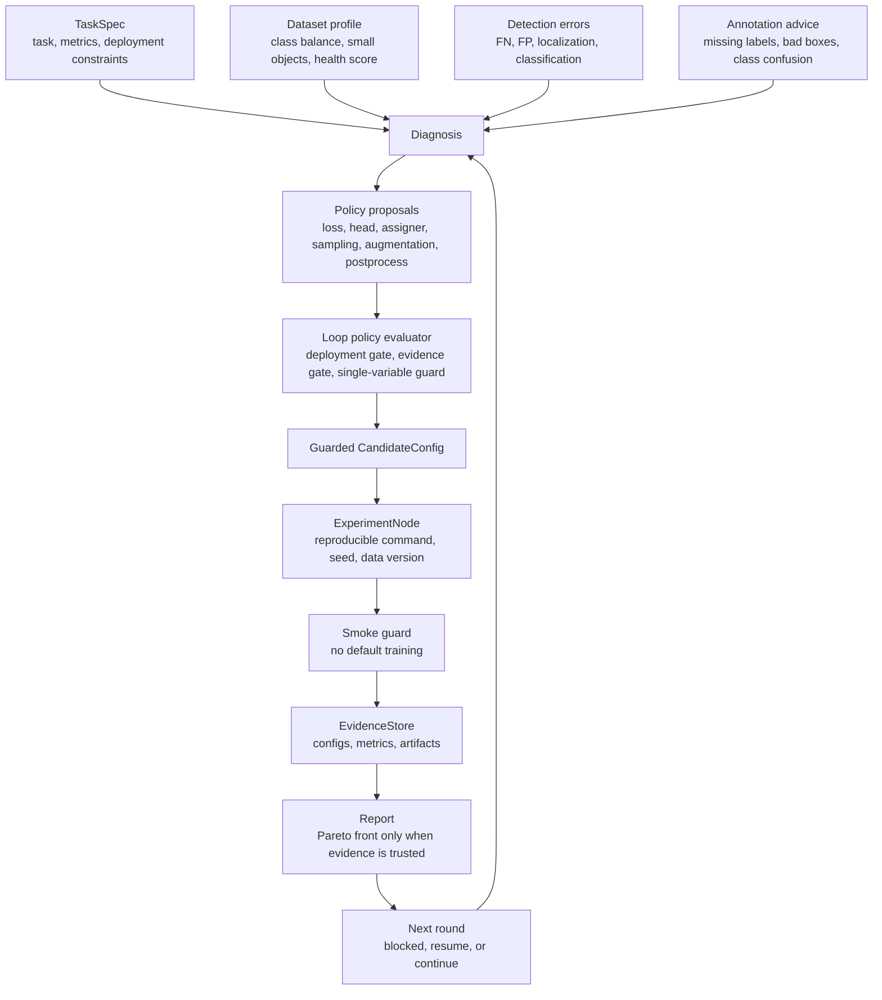

# yolo-agent

YOLO Agent is an evidence-driven object-detection optimization harness.

It is not a free-form code-generation agent, and it does not blindly generate model code or start training. It runs a controlled, auditable loop:

```text
task + data + errors + constraints
        -> diagnosis
        -> policy proposals
        -> guarded candidates
        -> evidence
        -> next round
```

## Closed Loop



The central design rule is simple: LLMs, humans, and rule engines may propose policies, but only evaluators and evidence gates can turn proposals into experiment candidates.

## What It Optimizes

YOLO Agent treats detection performance as a full-system problem, not just a model-architecture problem.

It can reason about:

- model scale and YOLO family
- backbone, neck, head, loss, assigner, optimizer metadata
- annotation quality and relabeling worklists
- dataset health, sampling, split leakage, and duplicate frames
- augmentation policy
- post-processing policy such as NMS, thresholds, TTA, and SAHI
- deployment limits such as latency, FPS, export format, and model size
- experiment reproducibility, ablation discipline, and evidence quality

## Loop Harness

The loop orchestrator is a state machine, not a script chain. It persists:

- `runs/{run_id}/run_context.yaml`
- `runs/{run_id}/loop_state.yaml`
- `runs/{run_id}/events.jsonl`
- `runs/{run_id}/artifacts/`

Default stage order is defined in `configs/loop_policy.yaml`:

```text
init -> profile_data -> advise_labels -> diagnose_errors -> generate_loop_plan
-> evaluate_policies -> generate_candidates -> ablate -> smoke
-> import_metrics -> report -> next_round
```

Stages with missing required evidence become `blocked` so the run can be resumed instead of silently producing untrusted recommendations.

```bash
yolo-agent loop --run runs/exp001 --resume
```

Each stage is governed by an executable contract, not only Python control flow. The loop policy declares:

- `requires`
- `provides`
- `evidence_required`
- `block_on_missing`
- `retry_policy`
- `producer_artifacts`

Stage starts, completions, failures, resume attempts, and contract blocks are appended to `events.jsonl` for audit and debugging.

## CLI

Initialize a scenario:

```bash
yolo-agent init --scenario infrared_small_target --output task.yaml
```

Run the loop in explicit phases:

```bash
yolo-agent loop init --run-id exp001 --task task.yaml --data data.yaml
yolo-agent loop diagnose --run runs/exp001 --errors errors.yaml
yolo-agent loop plan --run runs/exp001
yolo-agent loop smoke --run runs/exp001
yolo-agent loop ingest-metrics --run runs/exp001 --metrics results.csv
yolo-agent loop next --run runs/exp001
```

Run pending stages until the next block:

```bash
yolo-agent loop auto --run runs/exp001
```

Initialize and run in one command:

```bash
yolo-agent loop auto --task task.yaml --data data.yaml --components configs/components
```

Individual utilities are also available:

```bash
yolo-agent profile-data --data data.yaml --out runs/dataset_report
yolo-agent advise-labels --data data.yaml --predictions predictions.yaml --out runs/annotation_advice
yolo-agent plan --task task.yaml --components configs/components --out runs/plan.yaml
yolo-agent smoke --plan runs/plan.yaml --data data.yaml
yolo-agent ablate-plan --plan runs/plan.yaml --out runs/ablation_plan.yaml
yolo-agent report --run runs/exp001 --out report.md
```

## Evidence Contract

The harness uses an evidence gate before trusted recommendations. Default loop evidence includes:

- `dataset_report`
- `label_quality_report`
- `smoke_result`
- `latency_ms`
- `map50`
- `recall`

Missing required evidence is written to:

```text
runs/{run_id}/artifacts/evidence_status.json
```

Run-level metrics remain supported through `runs/{run_id}/metrics.json`, but candidate comparisons use node-level evidence:

```text
runs/{run_id}/metrics_by_node.jsonl
```

Each metric record is tied to a concrete candidate and experiment node:

```yaml
candidate_id: baseline
node_id: node_baseline
dataset_version: dataset-v3
split: val
metric_name: map50
value: 0.81
source: benchmark_csv
created_at: "2026-07-02T00:00:00Z"
```

`loop ingest-metrics` accepts the same fields as CSV columns, so Pareto selection, ablation contribution, and reports can distinguish which candidate produced each `map50`, `recall`, or `latency_ms` value.

Reports show:

```text
No evidence, do not trust this result.
```

and suppress best-model recommendations when the evidence gate is not trusted.

## Policy Boundary

YOLO Agent treats all strategy suggestions as proposals:

```text
PolicyProposal -> LoopPolicyEvaluation -> CandidateConfig -> ExperimentNode
```

The loop policy evaluator decides:

- which actions should run first
- which proposals are blocked by deployment constraints
- which proposals need more evidence before they can become experiments
- which proposals must be split into single-variable ablations

## Key Modules

- `yolo_agent/core/task_spec.py`: task and deployment schema
- `yolo_agent/tools/dataset_stats.py`: YOLO dataset profiling and health score
- `yolo_agent/core/label_quality.py`: label quality signals
- `yolo_agent/agents/annotation_advisor.py`: annotation worklists
- `yolo_agent/agents/error_to_action.py`: detection error taxonomy to actions
- `yolo_agent/agents/optimization_recipe.py`: loss/head/assigner/data-check recipes
- `yolo_agent/agents/sampling_policy.py`: data sampling recommendations
- `yolo_agent/agents/augmentation_policy.py`: data-driven augmentation policy
- `yolo_agent/components/postprocess.py`: post-processing strategy registry
- `yolo_agent/agents/error_driven_loop.py`: diagnosis-to-next-round composition
- `yolo_agent/agents/loop_policy_evaluator.py`: proposal-to-experiment gate
- `yolo_agent/agents/orchestrator.py`: state-machine loop runner
- `yolo_agent/core/evidence_contract.py`: evidence requirements and trust gate
- `yolo_agent/core/evidence_store.py`: local reproducibility store
- `yolo_agent/core/stage_contract.py`: executable stage requirements
- `yolo_agent/core/event_log.py`: append-only loop event audit log

## Non-Goals

The first versions intentionally do not:

- start real training by default
- copy unverified third-party loss implementations
- let LLM output directly decide experiments
- recommend a best model without evidence
- hide missing metrics behind invented values

## Development

```bash
python -m pip install -e ".[dev]"
python -m pytest
```

On Windows in this workspace, use:

```bash
py -3.12 -m pytest
```

Bundled scenario templates live under `configs/scenarios/` and validate against `yolo_agent.core.task_spec.TaskSpec`.
