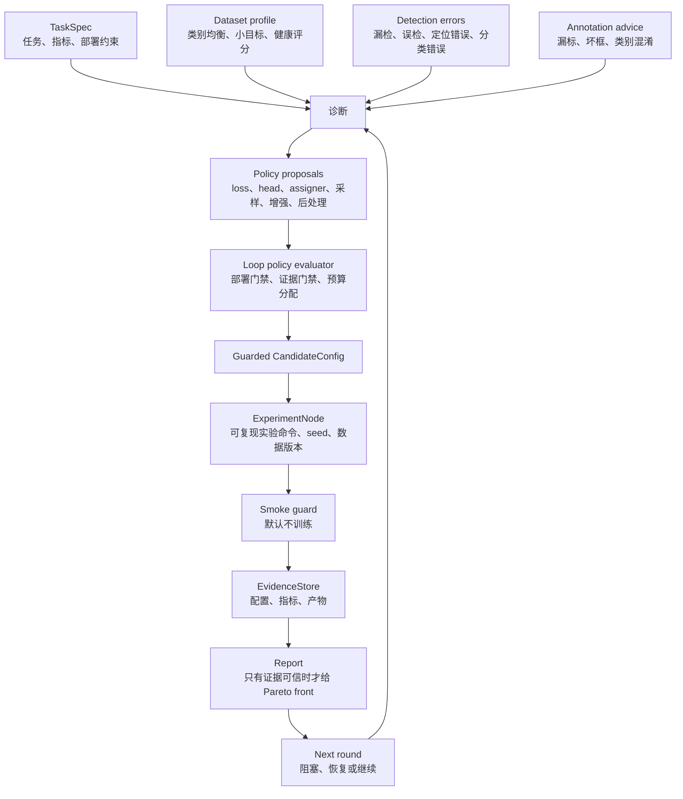

# yolo-agent

中文 | [English](README.en.md)

YOLO Agent 是一个以证据驱动的目标检测优化 harness。

它不是自由形式的代码生成 Agent，也不会盲目生成模型代码或默认启动训练。它运行的是一个受控、可审计、可恢复的优化闭环：

```text
任务 + 数据 + 错误样本 + 部署约束
        -> 诊断
        -> 策略提案
        -> 受保护的候选实验
        -> 证据
        -> 下一轮
```

## 闭环流程



核心设计规则很简单：LLM、人类和规则引擎只能提出策略；只有 evaluator 和 evidence gate 才能把策略变成实验候选。

## 自动化成熟度

YOLO Agent 按 agent harness 的方式建设，因此自动化成熟度取决于优化闭环是否显式、可恢复、受证据门禁保护，并且可审计。

当前成熟度：**Level 4，已经具备 Level 5 的基础模块。** 该 harness 已支持受保护的候选生成、loop state 持久化、执行队列、candidate-level evidence 导入、跨 run 对比和 lineage 追踪。Active learning 和数据版本化基础能力已经存在，但生产级 Level 5 仍需要把真实标注平台集成、数据版本晋级策略和 routine run 串起来。

- **Level 1: schema + metadata**：任务画像、场景配置、组件卡、兼容性元数据、可复现实验 schema
- **Level 2: guarded candidate generation**：候选策略经过兼容性检查、部署约束、smoke guard 和单变量消融约束
- **Level 3: evidence-driven loop**：loop state、stage contract、evidence gate、decision ledger、artifact manifest、报告和下一轮规划
- **Level 4: queued execution + cross-run learning**：执行队列、executor 边界、candidate/node-level metrics、lineage、forked run 和跨 run 对比
- **Level 5: active learning + dataset version evolution**：不确定性挖掘、复标 worklist、数据 manifest diff、数据版本晋级和 retraining loop handoff

## Executor 边界

执行被显式建模，但训练不是默认行为：

```text
ExperimentNode -> CommandSpec -> ExecutionResult -> EvidenceStore
```

`loop enqueue` 会在执行前，把计划好的 `ExperimentNode` 物化为可恢复的队列：

```text
ExperimentPlan -> ExecutionQueue -> Executor -> ExecutionResult -> EvidenceStore
```

当前 executor 抽象包括：

- `DryRunExecutor`：只记录将要运行什么，不真正执行命令
- `ShellExecutor`：对受控命令进行显式 subprocess 执行
- `UltralyticsExecutor`：保守的 Ultralytics smoke/草案执行器，默认不启动真实训练
- `UltralyticsTrainExecutor`：显式训练执行器，运行 typed `yolo detect train ...`，支持 resume、DDP device 字符串、多 GPU device list、日志采集、超时和结果导入
- `RuntimeProfiler`：从 Ultralytics args/results/log 和可用的 `nvidia-smi` 采样中提取 GPU 利用率、显存、it/s、epoch time、dataloader wait、batch size 和 cache mode，并写入 candidate/node-level evidence
- `BatchTuner`：在正式训练前短跑 batch 32/48/64/96，记录 OOM、it/s 和 GPU evidence，选择不改变 imgsz 的最高吞吐 batch
- `BenchmarkImporter`：把外部 benchmark 指标或 Ultralytics run 目录导入 run-level 和 candidate/node-level evidence

真实训练必须显式选择：

```bash
yolo-agent loop execute --run runs/exp001 --executor ultralytics-train
```

## 优化对象

YOLO Agent 把检测效果视为完整系统问题，而不仅是模型结构问题。

它可以推理：

- 模型尺寸和 YOLO family
- backbone、neck、head、loss、assigner、optimizer 元数据
- 标注质量和复标 worklist
- 数据健康度、采样、划分泄漏、重复帧
- 数据增强策略
- 后处理策略，例如 NMS、threshold、TTA、SAHI
- 部署限制，例如 latency、FPS、导出格式和模型大小
- 实验可复现性、消融纪律和证据质量

## Loop Harness

Loop orchestrator 是状态机，不是脚本拼接。它会持久化：

- `runs/{run_id}/run_context.yaml`
- `runs/{run_id}/loop_state.yaml`
- `runs/{run_id}/events.jsonl`
- `runs/{run_id}/dataset_versions/{dataset_version}/manifest.json`
- `runs/lineage.jsonl`
- `runs/{run_id}/execution_queue.yaml`
- `runs/{run_id}/artifacts/artifact_manifest.jsonl`
- `runs/{run_id}/artifacts/decision_ledger.jsonl`
- `runs/{run_id}/artifacts/execution_results/`
- `runs/{run_id}/artifacts/`

`loop init` 会解析 YOLO `data.yaml` 的根目录，通过 `DatasetVersionStore` 创建 dataset manifest，并把 `dataset_manifest_path` 和 `dataset_manifest_sha256` 写入 `run_context.yaml`。因此 resume 面对的是具体数据快照，而不是一个松散的数据集标签。

Stage 顺序由 `configs/loop_policy.yaml` 定义；保存的 `LoopState` 来自该 policy，而不是硬编码的 Python 执行列表：

```text
init -> profile_data -> advise_labels -> diagnose_errors -> generate_loop_plan
-> evaluate_policies -> generate_candidates -> ablate -> smoke
-> import_metrics -> report -> next_round
-> mine_samples -> label_handoff -> dataset_promote
```

缺少必要证据的 stage 会进入 `blocked`，这样 run 可以恢复，而不是静默产出不可信推荐。

```bash
yolo-agent loop --run runs/exp001 --resume
```

`next_round.yaml` 基于 delta，而不是复制 checklist。它记录 parent run、已知的最佳证据支持 candidate、未解决诊断、相对 parent 新补齐的 evidence、推荐下一 stage 和停止原因。

`fork-next` 会把 `artifacts/next_round.yaml` 物化为同一 run root 下的新 child run。Child run 会继承 task、dataset version、dataset manifest hash、component/search/policy path、parent run 尚未完成的 evidence list，以及解释为什么继续闭环的 delta 字段，同时在自己的 context 中记录 `parent_run_id` 和 fork artifacts。

跨 run lineage 会追加到 `runs/lineage.jsonl`，用于回答 parent/child 关系、继承的数据 manifest hash、上一轮以来补齐的 evidence，以及当前最佳可信 run。

每个 stage 都由可执行 contract 管理，而不只是 Python 控制流。Loop policy 声明：

- `requires`
- `provides`
- `evidence_required`
- `block_on_missing`
- `retry_policy`
- `producer_artifacts`
- `artifact_contract`

Stage start、complete、failure、resume attempt 和 contract block 都会追加到 `events.jsonl`，用于审计和调试。

Policy evaluation 会把 append-only decision ledger 写到 `artifacts/decision_ledger.jsonl`。每一行都会记录原始 proposal、evaluator decision、部署阻塞项、缺失证据、兼容性 warning，以及创建出的 `CandidateConfig` 或 `ExperimentNode`。

Stage 输出会记录到 `artifacts/artifact_manifest.jsonl`，包含 `name`、`type`、`path`、`sha256`、`producer_stage`、`created_at` 和 `schema_version`。Evidence loading 会优先使用 manifest-verified artifacts，因此 resume 和 report 能发现“文件存在但不再匹配本轮产物”的情况。

Artifact contract 会把这层保证提升为 stage gate。一个 stage 可以要求输入 artifact 有 current-run manifest entry、有效 SHA-256，以及可选 Pydantic schema，例如 `DatasetReport`、`CandidatePlan` 或 `SmokeRunResult`。这可以防止同名旧文件误满足 loop contract。

## CLI

初始化场景：

```bash
yolo-agent init --scenario infrared_small_target --output task.yaml
```

按显式阶段运行 loop：

```bash
yolo-agent loop init --run-id exp001 --task task.yaml --data data.yaml --training-config configs/training/yolo26_coco_goal.yaml
yolo-agent loop diagnose --run runs/exp001 --errors errors.yaml
yolo-agent loop plan --run runs/exp001
yolo-agent loop enqueue --run runs/exp001
yolo-agent loop execute --run runs/exp001 --executor dry-run
yolo-agent loop smoke --run runs/exp001
yolo-agent loop ingest-metrics --run runs/exp001 --metrics results.csv
yolo-agent loop next --run runs/exp001
yolo-agent loop run-stage --run runs/exp001 --stage mine_samples
yolo-agent loop run-stage --run runs/exp001 --stage label_handoff
yolo-agent loop run-stage --run runs/exp001 --stage dataset_promote
yolo-agent loop fork-next --run runs/exp001 --new-run-id exp002
yolo-agent loop lineage --run-root runs --run exp002
yolo-agent loop lineage --run-root runs --best
yolo-agent loop compare --runs runs/exp001 runs/exp002 --out comparison.md
```

TrainingBudgetProfile 用来把快速检查和可信 COCO 证据分开：

- `debug`: COCO `fraction=0.01`，`epochs=3`，`val=false`；只做 sanity check。
- `pilot`: COCO `fraction=0.1`，`epochs=10`，固定 `batch=64`；用于筛选候选。
- `baseline_full`: full COCO，`epochs=100`，seeds `1,2,3`；用于可信 baseline evidence。
- `candidate_full`: full COCO，`epochs=100`，seeds `1,2,3`；只给通过 pilot 的候选使用。

```bash
yolo-agent loop init --run-id exp001 --task task.yaml --data data.yaml --training-config configs/training/yolo26_coco_goal.yaml --training-profile debug
yolo-agent loop init --run-id exp001 --task task.yaml --data data.yaml --training-config configs/training/yolo26_coco_goal.yaml --training-profile pilot
```

运行 pending stages，直到下一个 block：

```bash
yolo-agent loop auto --run runs/exp001
```

初始化并自动运行：

```bash
yolo-agent loop auto --task task.yaml --data data.yaml --components configs/components
```

也可以单独使用工具命令：

```bash
yolo-agent profile-data --data data.yaml --out runs/dataset_report
yolo-agent advise-labels --data data.yaml --predictions predictions.yaml --out runs/annotation_advice
yolo-agent loop mine --run runs/exp001 --predictions unlabeled_predictions.json
yolo-agent plan --task task.yaml --components configs/components --out runs/plan.yaml
yolo-agent smoke --plan runs/plan.yaml --data data.yaml
yolo-agent ablate-plan --plan runs/plan.yaml --out runs/ablation_plan.yaml
yolo-agent report --run runs/exp001 --out report.md
```

## Evidence Contract

Harness 会在可信推荐前运行 evidence gate。默认 loop evidence 包括：

- `dataset_report`
- `label_quality_report`
- `smoke_result`
- `latency_ms`
- `map50`
- `recall`

缺失的必要 evidence 会写入：

```text
runs/{run_id}/artifacts/evidence_status.json
```

Run-level metrics 仍然支持 `runs/{run_id}/metrics.json`，但 candidate 对比使用 node-level evidence：

```text
runs/{run_id}/metrics_by_node.jsonl
```

Smoke guard 也会写入 candidate-level records：`smoke_passed`、`yaml_generated`、`ultralytics_imported`、`forward_checked`。因此在任何训练开始前，生成的 plan 都可以被审计。

每条 metric record 都绑定到具体 candidate 和 experiment node：

```yaml
candidate_id: baseline
node_id: node_baseline
dataset_version: dataset-v3
split: val
metric_name: map50
value: 0.81
source: benchmark_csv
verified: true
validator: official_eval
source_artifact: runs/exp001/results.csv
metric_schema_version: "1.0"
higher_is_better: true
confidence: 0.99
created_at: "2026-07-02T00:00:00Z"
```

`loop ingest-metrics` 接受同样字段作为 CSV columns，因此 Pareto selection、ablation contribution 和 reports 可以区分每个 `map50`、`recall` 或 `latency_ms` 来自哪个 candidate。`verified: false` 的 node-level metrics 会保留用于审计，但不会计入 Pareto front 或推荐所需的可信 evidence。

当 evidence gate 不可信时，报告会显示以下 warning，并抑制最佳模型推荐：

```text
No evidence, do not trust this result.
```

Cross-run comparison report 会增加 dataset-version 检查、manifest SHA 检查、Pareto-front 变化、`map50`/recall/latency delta，以及后续 run 中产生正贡献的 action。

## Policy Boundary

YOLO Agent 把所有策略建议都视为 proposal：

```text
PolicyProposal -> LoopPolicyEvaluation -> BudgetAllocation -> CandidateConfig -> ExperimentNode
```

Loop policy evaluator 决定：

- 哪些 action 应该优先运行
- 哪些 proposal 被部署约束阻塞
- 哪些 proposal 需要更多 evidence 才能变成 experiment
- 哪些 proposal 必须拆成单变量消融
- 哪些合格 proposal 能进入当前 round budget
- 哪些 proposal 需要延期
- 哪些 proposal 在运行前需要人工确认

Round budget 配置在 `configs/loop_policy.yaml` 的 `policy_budget` 下，包括 `max_candidates_per_round`、`max_high_risk_candidates`、`latency_budget_policy` 和 exploration/exploitation ratio targets。

## 关键模块

- `yolo_agent/core/task_spec.py`：任务和部署 schema
- `yolo_agent/tools/dataset_stats.py`：YOLO 数据集画像和健康评分
- `yolo_agent/core/label_quality.py`：标注质量信号
- `yolo_agent/agents/annotation_advisor.py`：标注复核 worklist
- `yolo_agent/agents/error_to_action.py`：检测错误体系到 action
- `yolo_agent/agents/optimization_recipe.py`：loss/head/assigner/data-check recipes
- `yolo_agent/agents/sampling_policy.py`：数据采样建议
- `yolo_agent/agents/augmentation_policy.py`：数据驱动增强策略
- `yolo_agent/components/postprocess.py`：后处理策略注册表
- `yolo_agent/agents/error_driven_loop.py`：诊断到下一轮计划的组合
- `yolo_agent/agents/loop_policy_evaluator.py`：proposal 到 experiment 的 gate
- `yolo_agent/agents/orchestrator.py`：状态机 loop runner
- `yolo_agent/core/evidence_contract.py`：evidence requirement 和 trust gate
- `yolo_agent/core/evidence_store.py`：本地可复现 evidence store
- `yolo_agent/core/stage_contract.py`：可执行 stage requirements
- `yolo_agent/core/event_log.py`：append-only loop event audit log

## 非目标

早期版本刻意不做：

- 默认启动真实训练
- 复制未经验证的第三方 loss 实现
- 让 LLM 输出直接决定实验
- 在没有 evidence 时推荐最佳模型
- 用编造的数值隐藏缺失指标

## 开发

```bash
python -m pip install -e ".[dev]"
python -m pytest
```

在当前 Windows workspace 中使用：

```bash
py -3.12 -m pytest
```

内置场景模板位于 `configs/scenarios/`，并会根据 `yolo_agent.core.task_spec.TaskSpec` 校验。
