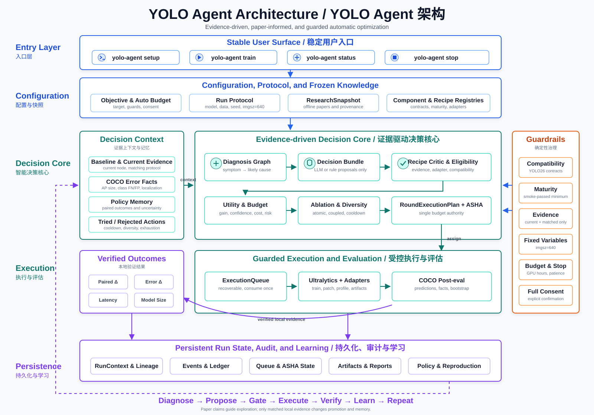

# YOLO Agent

English | [简体中文](README.zh-CN.md)

YOLO Agent is an evidence-driven optimization runner for YOLO object detection. It connects training, COCO evaluation, error diagnosis, paper-informed recipes, matched comparisons, budget control, and reporting in a recoverable workflow.

LLMs may analyze evidence and propose recipes, but deterministic gates control compatibility, experiment budgets, promotion, and full-run consent.



## Highlights

- One command starts environment checks, debug training, and bounded pilot optimization.
- Candidate decisions use matched controls, local evidence, latency, and model-size guards.
- ASHA manages pilot budgets and eliminates weak candidates early.
- Paper Intelligence imports catalogs offline into a frozen `ResearchSnapshot`.
- Component maturity prevents metadata-only or unverified adapters from entering training.
- Paper recipes require a hash-bound runtime adapter and matched control before ASHA can allocate a pilot.
- Every run writes auditable plans, events, evidence, queue state, and reports.

## Install

Python 3.12 and an isolated environment are recommended.

```powershell
git clone https://github.com/whut09/YOLO-Agent.git
cd YOLO-Agent
py -3.12 -m venv .venv
.\.venv\Scripts\Activate.ps1
python -m pip install -U pip
python -m pip install -e ".[train]"
```

For GPU certification and complete COCO post-evaluation support:

```powershell
python -m pip install -e ".[train,certification]"
```

## Quick Start

New users only need four commands.

```powershell
# 1. Validate the environment
yolo-agent setup coco --data E:\dataset\coco.yaml --model yolo26n.pt

# 2. Start bounded automatic pilot optimization
yolo-agent train --model yolo26n.pt --data E:\dataset\coco.yaml --run-id coco-yolo26n

# 3. Inspect the parent run and active child run
yolo-agent status --run runs/coco-yolo26n

# 4. Stop safely
yolo-agent stop --run runs/coco-yolo26n
```

The default budget is automatic and pilot-only. Full COCO training requires explicit confirmation.
Real training preflights a frozen research snapshot before allocating the run; stale paper or adapter maturity state must be rebuilt offline first.

`--goal` accepts structured expressions such as `+2map`. Keep natural-language intent
separate when targeting a diagnostic metric:

```powershell
yolo-agent train --model yolo26n.pt --data E:\dataset\coco.yaml --run-id coco-small --target-metric ap_small --target-delta 0.02 --goal-description "Reduce small-object false negatives"
```

## Decision Workflow

```text
trusted baseline and current evidence
-> COCO error facts and diagnosis
-> paper and local recipe proposals
-> compatibility, maturity, and evidence gates
-> matched pilot cohort
-> post-evaluation and paired delta
-> ASHA elimination or promotion
-> report and policy-memory update
```

If required evidence is incomplete, the queue requests evidence recovery instead of promoting another training run. Training keeps `imgsz=640` for YOLO26 comparisons and does not increase it automatically.

## Paper Intelligence

YOLO Agent can import [Awesome-object-detection](https://github.com/whut09/Awesome-object-detection) before training and build a frozen research snapshot. Training never fetches papers from the network.

Paper records are priors, not local results:

- A paper entry does not mean an adapter exists.
- An implemented adapter is not executable until its runtime path and smoke tests pass.
- A single pilot improvement is `possible`, not `confirmed`.
- Paper metrics never count as promotion evidence.

<!-- paper-adapter-coverage:start -->
| Frozen papers | Implemented adapters | Runtime integrated | Pilot reproduced |
| --- | --- | --- | --- |
| 728 | 13 | 0 | 0 |

These counts are independent; paper records and adapter classes do not promote runtime or reproduction maturity.
Audit snapshot: `c606d6c50fefaa7ae0db8bddb39d62057ff09ed5aeae943c81c990971b353e57`.
<!-- paper-adapter-coverage:end -->

## Capability Boundaries

<!-- capability-maturity:start -->
| Capability | Current status | Code present | Automatic execution | Local reproduction | Boundary |
| --- | --- | --- | --- | --- | --- |
| Automatic pilot training | `executable` | yes | yes | depends on local runs | The default training entrypoint can execute debug and pilot runs; success depends on the local environment and data. |
| Automatic basic metric import | `executable` | yes | yes | depends on local runs | Imports results.csv, training artifacts, and basic runtime evidence; missing artifacts still produce an evidence gap. |
| Candidate COCO error facts | `incomplete` | yes | partial | partial | Post-eval, import, and completeness gates exist, but every candidate is not yet guaranteed to produce predictions.json and complete per-class/FN/FP/localization facts. |
| Error-delta next-round decisions | `partial` | yes | partial | partial | Compares parent/current error facts and constrains proposals; incomplete candidate facts fall back to evidence collection or rules. |
| ASHA / successive-halving queue control | `executable` | yes | guarded | not claimed | ASHA assignments feed the authoritative RoundExecutionPlan and queue; full rungs still require explicit confirmation and are not automatic by default. |
| Paper component adapters | `incomplete` | yes | no | not claimed | Thirteen adapters are implemented, but no component has artifact-backed runtime integration or pilot reproduction; paper entries cannot enter training queues. |
| Three-seed confirmation | `supported, not automatic end-to-end` | yes | explicit confirmation | not claimed | The scheduler and confidence gates support three seeds; candidate_full requires explicit confirmation and the default pilot loop does not run all seeds automatically. |
| Stable +2 mAP improvement | `not guaranteed` | no | no | not claimed | +2 mAP is an objective and acceptance condition, not a project guarantee; it requires a matched baseline, full COCO, three seeds, and confidence intervals. |
<!-- capability-maturity:end -->

## Documentation

- [Quick start](docs/quickstart.md)
- [Installation](docs/install.md)
- [CLI and advanced commands](docs/cli.md)
- [Training modes](docs/training-modes.md)
- [COCO and YOLO26](docs/coco-yolo26.md)
- [Custom datasets](docs/custom-dataset.md)
- [LLM setup](docs/llm-setup.md)
- [Evidence model](docs/evidence.md)
- [Paper Intelligence](docs/paper-intelligence.md)
- [Paper adapter implementation queue](docs/paper-adapter-implementation-queue.md)
- [Paper recipe materialization](docs/paper-recipe-materialization.md)
- [Awesome-object-detection integration](docs/awesome-object-detection.md)
- [Capability maturity](docs/capability-maturity.md)
- [GPU certification](docs/gpu-certification.md)
- [SAHI inference certification](docs/sahi-inference-certification.md)
- [Troubleshooting](docs/troubleshooting.md)

## Development

```powershell
python -m pip install -e ".[dev]"
pytest -q
ruff check .
```

The project is licensed under the MIT License.
