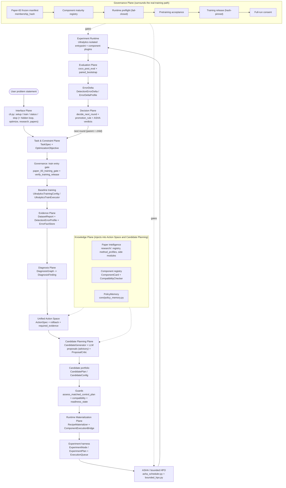
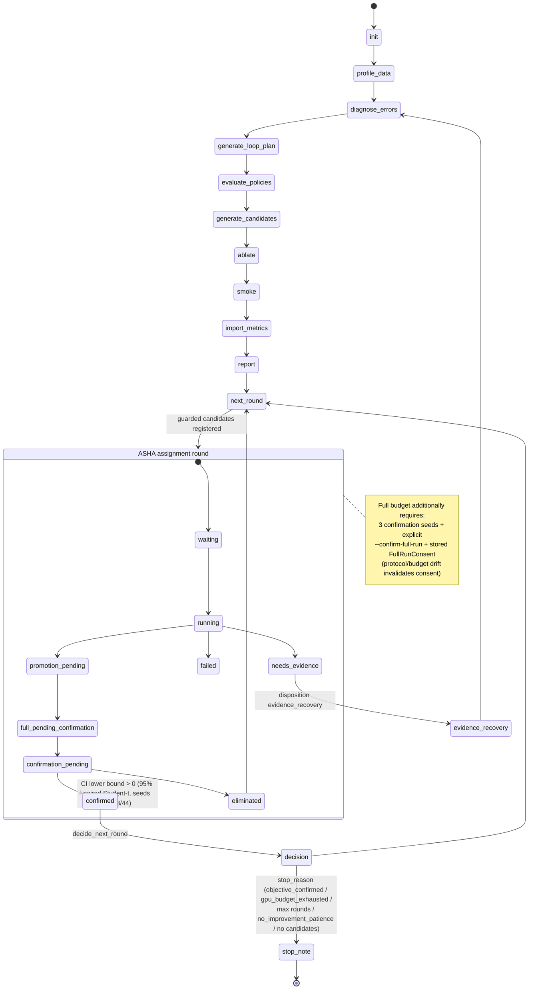
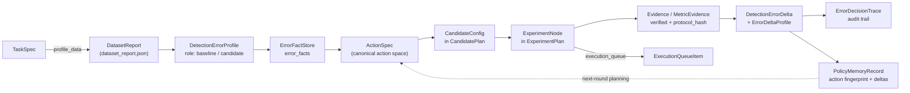

# System Architecture (Canonical)

This document is the canonical description of the YOLO-Agent system
architecture. It is derived from the actual source tree: every module path,
class name, state name, and policy value below is verifiable in the repository
as of `training_release_v1` (`artifacts/training_release_v1.yaml`, git commit
`3228dcc6`).

Scope split:

- **This document** — the whole system: planes, authority boundaries, state
  machine, artifact flow, invariants.
- [Automatic optimization architecture](automatic-optimization-architecture.md)
  — a deep dive into the optimization loop only (coverage funnel, budget
  semantics, decision semantics).

Everything in this document describes what the code does, not what a paper
promises. The system outputs measured decisions, including rejection,
evidence-recovery, and inconclusive verdicts.

---

## 1. Logical planes

The codebase organizes naturally into the following planes. The mapping is
derived from real modules; no plane requires a module that does not exist.

| # | Plane | Real modules (representative) | Responsibility |
|---|-------|-------------------------------|----------------|
| 1 | Interface Plane | `yolo_agent/cli.py` (`build_parser`, `main`), `tools/setup_wizard.py`, `tools/doctor.py` | CLI surface; visible commands `setup/train/status/stop`; hidden `loop/`, `optimize/`, `research/`, `papers/` namespaces |
| 2 | Task & Constraint Plane | `core/task_spec.py` (`TaskSpec`, `DatasetSpec`, `DeploymentSpec`, `MetricPriority`), `core/optimization_objective.py` | Parse the user's problem statement and deployment constraints; evaluate objective achievement |
| 3 | Evidence Plane | `core/detection_error_profile.py`, `core/detection_error_profile_builder.py`, `core/error_facts.py`, `core/evidence_store.py`, `core/schemas.py` (`DatasetProfile`), `tools/dataset_stats.py` (`DatasetReport`) | Build error facts from real ground truth and real predictions; never from a mAP drop alone |
| 4 | Diagnosis Plane | `agents/diagnosis_graph.py` (`DiagnosisGraph`, `DiagnosisFinding`), `agents/error_to_action.py` (`ErrorActionMapper`) | Rule-based attribution of error facts to canonical mechanisms |
| 5 | Knowledge Plane | `research/` (paper registry, `method_profiles.py`, side modules `paper_data_side.py`/`paper_loss_side.py`/`paper_graph_side.py`/`paper_inference_side.py`/`paper_domain_side.py`), `core/policy_memory.py` (`PolicyMemoryStore`) | Paper intelligence, method profiles, and cross-run policy memory |
| 6 | Unified Action Space | `agents/action_space.py`, `agents/action_space_schemas.py` (`ActionSpec`, `ActionRollback`, `DiagnosisActionChain`) | Canonical catalog of actions with rollback plans, search spaces, required evidence |
| 7 | Candidate Planning Plane | `agents/candidate_generator.py` (`CandidateGenerator`, `CandidatePlan`), `agents/utility_scorer.py`, `agents/exploration_diversity.py`, `agents/llm_decision_advisor.py`, `agents/llm_proposal_critic.py` | Portfolio generation from diagnosis + knowledge; LLM proposals are advisory input only |
| 8 | Runtime Materialization Plane | `recipes/recipe_materializer.py` (`RecipeMaterializer`), `components/execution_bridge.py` (`ComponentExecutionBridge`), `components/adapters/runtime.py` | Recipe + maturity → adapter runtime payload → concrete command and rollback plan |
| 9 | Experiment Harness | `core/execution_queue.py`, `core/resource_scheduler.py`, `core/executor.py` (`UltralyticsTrainExecutor`), `core/experiment_graph.py` (`ExperimentNode`, `ExperimentPlan`), `tools/smoke_runner.py` | Durable execution queue, GPU-aware scheduling, experiment plan DAG |
| 10 | Experiment Runtime | `adapters/ultralytics/training.py`, `adapters/ultralytics/adapter.py`, `adapters/ultralytics/runtime_entrypoint.py`, `adapters/ultralytics/plugin_bridge.py`, `components/adapters/` (neck/distillation/assigners/heads/losses/data_pipeline/inference) | The only place that touches real training; isolated plugin-enabled Ultralytics entrypoint |
| 11 | Evaluation Plane | `adapters/ultralytics/coco_post_eval.py`, `core/paired_bootstrap.py`, `agents/error_delta_profile.py`, `core/detection_error_delta.py` | Fixed post-evaluation protocol; paired candidate/parent deltas |
| 12 | Decision Plane | `agents/loop_decision_engine.py`, `core/error_round_decision.py`, `agents/promotion_rule.py`, `core/error_decision_trace.py` (`ErrorDecisionTrace`), `agents/asha_scheduler.py` (verdicts) | Next-round decisions, promotion verdicts, audit traces |
| 13 | Governance Plane | `research/paper_83_training_gate.py`, `components/maturity.py` + `components/maturity_registry_schemas.py`, `research/paper_runtime_preflight.py`, `research/pretraining_acceptance.py`, `research/training_release.py`, `core/full_run_consent.py`, `core/readiness_state.py` | Fail-closed gate chain that surrounds the entire training path |
| 14 | Persistence / Artifact Plane | `core/run_context.py`, `core/run_lineage.py`, `core/event_log.py`, `core/yaml_io.py`, `artifacts/`, `runs/` | Every stage writes versioned YAML artifacts; runs are immutable except supersede renames |

Two support planes cut across the flow:

- **Knowledge Plane (5)** injects into Action Space (6) and Candidate Planning
  (7): paper priors (`recipes/paper_priors.py`), method profiles, component
  cards (`components/registry.py`), and policy memory records.
- **Governance Plane (13)** wraps the real training path: no training command
  is built unless the gate chain passed, and the runtime entrypoint re-checks
  the gate at process start (`adapters/ultralytics/runtime_entrypoint.py`
  calls `gate_guard()`).

---

## 2. Diagram 1 — System Architecture

Round flow in one sentence: user goal → TaskSpec → baseline → evidence →
diagnosis → action space → candidate portfolio → guards → materialization →
experiment plan → ASHA/bounded HPO → training runtime → evaluation →
error delta → decision → next round. Policy memory feeds the next round's
planning with measured pilot-to-full predictions.

---

## 3. Diagram 2 — Authority Boundary

The rule the code enforces: **LLM output is proposal input; evaluators and
gates decide what is executable.** This is literal in
`agents/llm_decision_advisor.py` (`LLMProposalBundle` docstring) and enforced
by `agents/llm_proposal_critic.py` plus pydantic constraints
(`LLMPaperRecipeProposal._recipe_shape` — an LLM proposal cannot change
`imgsz=640` and cannot request `candidate_full`).

```mermaid
flowchart LR
    subgraph LLM["LLM may (advisory only)"]
        L1["Explain evidence<br/>llm_decision_advisor.propose"]
        L2["Form hypotheses<br/>RootCauseHypothesis drafts"]
        L3["Propose candidates<br/>LLMPaperRecipeProposal (pydantic-bounded)"]
        L4["Rank / score proposals<br/>utility_scorer + diversity policy"]
    end
    subgraph Det["Deterministic modules own"]
        D1["Validation<br/>pydantic validators, MatchedControlPlan.validate_hashes"]
        D2["Compatibility<br/>CompatibilityChecker, assess_matched_control_plan"]
        D3["Budget<br/>ASHAScheduler.next_assignment, BoundedSearchSpace"]
        D4["ASHA verdicts<br/>paired delta ranking, rung promotion"]
        D5["Promotion<br/>PromotionRule + 95% paired Student-t CI"]
        D6["Release verification<br/>verify_training_release (hash re-check)"]
    end
    LLM -->|"proposals only"| Critic["LLMProposalCritic<br/>(deterministic review)"]
    Critic -->|"accepted proposals enter pool"| Det
    LLM -.->|"blocked: decision_mode=<br/>deterministic_fallback"| Det
```

Explicitly forbidden to the LLM (all enforced in code, not by convention):

- Mark evidence as verified — `MetricEvidence.verified` is set by evidence
  gates, and `core/execution_fingerprint.py` (`paired_evidence_is_valid`)
  re-checks pairing identity.
- Bypass compatibility — `CompatibilityChecker` and
  `assess_matched_control_plan` compare protocol hash, dataset manifest hash,
  split, fidelity, seed policy, and `imgsz` per dimension.
- Bypass runtime readiness — `ASHAScheduler.register_trial` rejects any paper
  trial without `paper_readiness_state: asha_eligible` and quarantines
  unauthorized trials (`_quarantine_unauthorized_paper_trials`).
- Allocate full-run budget — `candidate_full` requires ASHA promotion plus
  explicit `--confirm-full-run` plus a stored `FullRunConsent`.
- Promote a candidate without metrics — promotion reads paired metric deltas
  and confidence intervals computed by deterministic code.
- Modify Paper-83 membership — the manifest is frozen
  (`configs/research/paper_83_manifest.yaml`, `frozen: true`, membership
  hash); the training gate fails closed on any mismatch.

---

## 4. Diagram 3 — Run State Machine

State names below are the **actual literals in code** (the loop has no
uppercase state constants; state lives in lowercase string literals and
`Literal` types):

- Loop stages: `LoopStage` in `core/loop_state.py` — `init`,
  `profile_data`, `advise_labels`, `diagnose_errors`, `generate_loop_plan`,
  `evaluate_policies`, `generate_candidates`, `ablate`, `smoke`,
  `import_metrics`, `report`, `next_round`, `mine_samples`, `label_handoff`,
  `dataset_promote`; per-stage `StageStatus`: `pending | running |
  completed | blocked | failed | skipped`.
- Queue items: `QueueStatus` in `core/execution_queue.py` — `queued |
  running | paused | blocked_by_resource | needs_resume | completed |
  failed | skipped | needs_evidence`.
- ASHA rungs (`ASHAStageId`): `pilot_3 → pilot_10 →
  candidate_full_seed_1 → candidate_full_confirmation`.
- ASHA trials (`ASHATrialStatus`): `waiting | running |
  promotion_pending | full_pending_confirmation | confirmation_pending |
  eliminated | confirmed | failed | needs_evidence`.
- Verdicts (`PromotionVerdict`): `CONFIRMED | POSSIBLE | REJECTED |
  INCONCLUSIVE`.
- Candidate dispositions: `queued | already_tested | evidence_recovery |
  implementation_request | incompatible | blocked_runtime |
  deferred_budget`.

Two lifecycle behaviors worth naming:

- **Supersede**: a round whose protocol fingerprint no longer matches is
  renamed `<run_id>.superseded-<hash12>-<timestamp>` and rebuilt
  (`_supersede_stale_protocol_round` in `agents/auto_optimization_loop.py`).
  Runs are otherwise immutable.
- **Round budget**: the safety cap is `max_rounds_safety = 60`
  (`core/optimization_budget.py`; the config key in
  `configs/training/yolo26_coco_goal.yaml` is `max_auto_rounds_safety: 60`,
  which `OptimizationBudget` maps onto the `max_rounds_safety` field).
  The banner "round 1/59" means start round 1 with an end index of 59 — the
  configured truth is 60, and the end index is `safety_limit - existing
  round directories`.

---

## 5. Diagram 4 — Artifact / Data Flow

Real artifact entities (names as they exist in code; the prompt's short names
map to the real classes where they differ):

| Concept | Real class | Defined in | Role in the flow |
|---------|-----------|------------|------------------|
| TaskSpec | `TaskSpec` | `core/task_spec.py` | User goal + constraints; consumed by data, candidate, and policy stage runners |
| DatasetProfile | `DatasetProfile` (light) / `DatasetReport` (rich, per-round) | `core/schemas.py` / `tools/dataset_stats.py` | Data profiling output (`dataset_report.json`) |
| ErrorProfile | `DetectionErrorProfile` | `core/detection_error_profile.py` | Baseline- and candidate-role error facts built from real GT + predictions |
| ActionSpec | `ActionSpec` | `agents/action_space_schemas.py` | Canonical action with parameters, rollback, required evidence |
| Candidate | `CandidateConfig` (+ `CandidatePlan` container) | `agents/candidate_generator.py` | Proposed experiment configuration |
| ExperimentNode | `ExperimentNode` (+ `ExperimentPlan`) | `core/experiment_graph.py` | Queue-able node bound to a candidate, seed, and changed-variables set |
| Evidence | `Evidence` / `MetricEvidence` | `core/experiment_graph.py` | Metrics with `verified`, `protocol_hash`, `dataset_manifest_sha256`, `evidence_role` |
| ErrorDelta | `DetectionErrorDelta` + `ErrorDeltaProfile` | `core/detection_error_delta.py` / `agents/error_delta_profile.py` | Paired candidate-vs-parent differences at evidence level and metric level |
| DecisionTrace | `ErrorDecisionTrace` | `core/error_decision_trace.py` | Per-round audit: problem, gate verdict, hypotheses, rejected/selected/observed |
| PolicyMemory | `PolicyMemoryRecord` (+ `PolicyMemoryStore`) | `core/policy_memory.py` | Cross-run memory keyed by `ActionFingerprint`, with `pilot_3/pilot_10/full` deltas |

Key connections (function-verified):

- `TaskSpec` + `DatasetReport` enter every stage via
  `agents/data_stage_runner.py` (`profile_data`, `diagnose_errors`).
- `CandidateConfig` becomes an `ExperimentNode` in
  `agents/loop_policy_evaluator.py` (`evaluate_one` builds
  `node_<candidate_id>` and attaches a `CommandSpec`), then an
  `ExecutionQueueItem` via `ExecutionQueueItem.from_node`
  (`core/execution_queue.py`).
- `DetectionErrorDelta` is computed by
  `build_detection_error_delta(candidate, parent)` only when the two profiles
  match on `gt_artifact`, `dataset_manifest_hash`, and `split`.
- `PolicyMemoryRecord.fill_derived_fields` derives `effect_delta` from the
  measured delta and links back to `candidate_id`/`node_id`.

---

## 6. Package map

Concept → real module (generated from the repository tree; nothing invented).

| Concept | Actual package / module | Responsibility | Input | Output |
|---------|------------------------|----------------|-------|--------|
| CLI | `yolo_agent/cli.py` (`main`, `build_parser`) | Command surface; exceptions → `runs/<run_id>/artifacts/logs/cli_exception.log` | argv | command dispatch |
| Task parsing | `yolo_agent/core/task_spec.py` | `TaskSpec`/`DatasetSpec`/`DeploymentSpec` models | task YAML | validated TaskSpec |
| Objective | `yolo_agent/core/optimization_objective.py` | Goal evaluation, stop reasons | metric records + objective YAML | `should_stop`, blockers |
| Data profiling | `yolo_agent/tools/dataset_stats.py` | Dataset statistics | dataset path | `DatasetReport` |
| Error profiling | `yolo_agent/core/detection_error_profile_builder.py` | FN/FP/localization/classification/confidence facts from real GT+predictions | GT + predictions | `DetectionErrorProfile` |
| Diagnosis | `yolo_agent/agents/diagnosis_graph.py` | Rule engine: facts → mechanism findings | error facts | `DiagnosisFinding` list |
| Action space | `yolo_agent/agents/action_space.py`, `action_space_schemas.py` | Canonical actions + rollback | findings, knowledge | `ActionSpec`, chains |
| LLM proposals | `yolo_agent/agents/llm_decision_advisor.py`, `llm_proposal_critic.py` | Advisory proposals + deterministic critique | evidence + findings | accepted proposals only |
| Candidate generation | `yolo_agent/agents/candidate_generator.py` | Portfolio sampling under diversity/utility policies | actions, knowledge | `CandidatePlan` |
| Matched control | `yolo_agent/core/matched_baseline.py` | Candidate/control dimension comparison | candidate + control nodes | `MatchedControlPlan` verdict + blockers |
| Recipe materialization | `yolo_agent/recipes/recipe_materializer.py`, `yolo_agent/agents/paper_recipe_materialization/gate.py` | Prior + maturity → executable recipe or blocker | paper prior, maturity artifacts | materialization result |
| Component bridge | `yolo_agent/components/execution_bridge.py` | Component card → adapter payload → command + rollback | `ComponentCard`, config | `AdapterRuntimePayload`, command spec |
| Round plan | `yolo_agent/core/round_execution_plan.py` | Round authority validation, matched-control binding | nodes + protocol hashes | validated plan (`RoundExecutionPlan`) |
| Execution queue | `yolo_agent/core/execution_queue.py`, `resource_scheduler.py` | Durable queue, GPU-aware scheduling | experiment nodes | queue items |
| ASHA | `yolo_agent/agents/asha_scheduler.py` | 4-rung budget ladder, guarded registration, verdicts | trials + observations | assignments, verdicts, `asha_state.yaml` |
| Bounded HPO | `yolo_agent/agents/bounded_hpo.py`, `core/hpo_candidate_planner.py` | Search-space caps, HPO point planning | action search space | HPO points (bounded) |
| Ultralytics runtime | `yolo_agent/adapters/ultralytics/training.py`, `adapter.py`, `runtime_entrypoint.py` | Config → command; isolated plugin-enabled entry; budget profiles | payload + budget profile | training process + results |
| Post-eval | `yolo_agent/adapters/ultralytics/coco_post_eval.py` | Fixed COCO evaluation report | trained model + dataset | eval report artifact |
| Paired stats | `yolo_agent/core/paired_bootstrap.py`, `yolo_agent/agents/component_contribution.py` | Paired bootstrap CI, Student-t critical values | paired metric records | CIs |
| Delta | `yolo_agent/core/detection_error_delta.py`, `yolo_agent/agents/error_delta_profile.py` | Candidate-vs-parent deltas | two matched profiles | `DetectionErrorDelta`, `ErrorDeltaProfile` |
| Decision | `yolo_agent/agents/loop_decision_engine.py`, `yolo_agent/core/error_round_decision.py`, `yolo_agent/agents/promotion_rule.py` | Next-round choice, Pareto scoring, promotion verdicts | deltas + traces | `RoundDecision`, `PromotionDecision` |
| Policy memory | `yolo_agent/core/policy_memory.py` | Cross-run action memory + pilot→full prediction | deltas | `PolicyMemoryRecord` store |
| Governance gates | `yolo_agent/research/paper_83_training_gate.py`, `paper_runtime_preflight.py`, `pretraining_acceptance.py`, `training_release.py` | Fail-closed chain: manifest → preflight → acceptance → release | manifests + artifacts | allow/block + pinned release |
| Consent | `yolo_agent/core/full_run_consent.py` | Full-budget consent bound to objective/dataset/protocol hashes + GPU-hours cap | user grant | `full_run_consent.yaml` |
| Certification | `yolo_agent/certification/` (`runner.py`, `paper_readiness.py`, `component_queue_gate.py`) | Opt-in local GPU/COCO and per-component certification | hardware + components | certification reports |
| Reports | `yolo_agent/reports/` | Experiment, cross-run, Pareto, recipe reports | artifacts | markdown/yaml reports |

Weight reference (largest modules): `agents/auto_optimization_loop.py`
(~8.5k lines), `cli.py` (~7.6k), `core/executor.py` (~2.2k),
`components/adapters/distillation/yolo26_distillation.py` (~1.75k),
`certification/paper_readiness.py` (~1.7k). The `yolo_agent` package itself is
roughly 167k lines of Python (excluding tests).

---

## 7. Architecture invariants

Each invariant is enforced by deterministic code, with the enforcing location
named.

1. **Paper prior ≠ local evidence.** A recipe defined from a paper is not
   evidence; executability requires maturity artifacts and, for statistics,
   locally measured paired deltas. (Coverage funnel in
   `docs/automatic-optimization-architecture.md`.)
2. **Candidate ≠ executable experiment.** A `CandidateConfig` only becomes
   queue-able after compatibility, matched-control readiness
   (`assess_matched_control_plan`), and readiness stamping
   (`paper_readiness_state: asha_eligible`) all pass.
3. **Smoke ≠ reproduction.** `smoke` is a short connectivity run; reproduction
   requires the certification suites (`certification/`) with real hardware or
   full-COCO protocols.
4. **Pilot ≠ confirmation.** `pilot_3`/`pilot_10` (3/10 epochs, top-fraction
   promotion) never confirm anything; confirmation requires 100-epoch seeds
   42/43/44 with the paired two-sided 95% Student-t CI lower bound > 0
   (`_finish_confirmation`, `_paired_seed_confidence_interval` in
   `agents/asha_scheduler.py`).
5. **LLM ≠ budget authority.** LLM proposals cannot request
   `candidate_full` (`LLMPaperRecipeProposal._recipe_shape`); ASHA owns all
   budget allocation; `--confirm-full-run` + stored `FullRunConsent` own
   full-run authorization.
6. **Inference policy ≠ training component.** Inference-side adapters
   (`components/adapters/inference/`, SAHI) never alter training; training
   control lives in the training path and is certified separately
   (`docs/inference-policy-adapters.md`).
7. **`imgsz` is fixed at 640** for this campaign. Enforced in
   `recipes/paper_priors.py` (variable imgsz → raise), `core/matched_baseline.py`
   (`imgsz: Literal[640]`), `agents/asha_scheduler.py` (candidate/control must
   be 640), `agents/llm_decision_advisor.py` (proposal constraint), and
   `certification/assignment_pilot_gate.py` (blocker `fixed_imgsz_640_required`).
8. **HPO is bounded.** Search spaces come from actions through
   `BoundedSearchSpace`/`search_space_from_action`; unbounded HPO requests are
   rejected (`agents/bounded_hpo.py`).
9. **Full-run policy.** `full_requires_confirmation: true`
   (`configs/training/yolo26_coco_goal.yaml`): full COCO training requires ASHA
   promotion through the ladder, 3 confirmation seeds, explicit
   `--confirm-full-run`, and a `FullRunConsent` bound to
   objective/dataset/protocol hashes and `authorized_max_gpu_hours` (default
   cap 24 GPU-hours); any hash or budget drift invalidates the consent.
10. **Round budget.** Safety cap `max_rounds_safety: 60`; the displayed end
    index is derived from existing round directories
    (`agents/optimize_runner.py`, `_bounded_auto_rounds`).
11. **Fail-closed governance chain.** Frozen Paper-83 manifest (membership
    hash) → component maturity registry (below `smoke_passed` is a blocker) →
    runtime preflight (unknown hook outcomes downgrade PASS to FAIL) →
    pretraining acceptance (`training_gate.allowed ≡ all critical checks pass
    ≡ verdict PASS`) → hash-pinned training release (`READY_FOR_FIRST_TRAINING`
    only when 83/83 ready) → five-condition candidate eligibility (frozen-83
    membership, implementation-ready, exactness PASS, preflight PASS, release
    fingerprint without drift) → guarded ASHA registration → full-run consent.

---

## 8. Related documents

- [Automatic optimization architecture](automatic-optimization-architecture.md)
  — optimization loop deep dive (coverage funnel, budget and decision semantics).
- [Evidence model](evidence.md) — evidence contracts and pairing rules.
- [Paper Intelligence](paper-intelligence.md) — catalog, method profiles.
- [Paper recipe materialization](paper-recipe-materialization.md) — gates from
  paper prior to executable recipe.
- [Capability maturity](capability-maturity.md) — maturity ladder and registry.
- [Paper-83 campaign](paper-83-campaign.md) — frozen membership, the three 83
  numbers, implementation vs reproduction boundary.
- [Training readiness pipeline](training-readiness.md) — the six gates before
  the first training run, with proves/does-not-prove for each.
- [Training release](training-release.md) — hash-pinned evidence snapshot and
  fail-closed verification at every training entry.
- [Training modes](training-modes.md) — budget profiles and flags.
- [CLI and advanced commands](cli.md) — every command and flag.
- [Quick start](quickstart.md) — first-run walkthrough.
