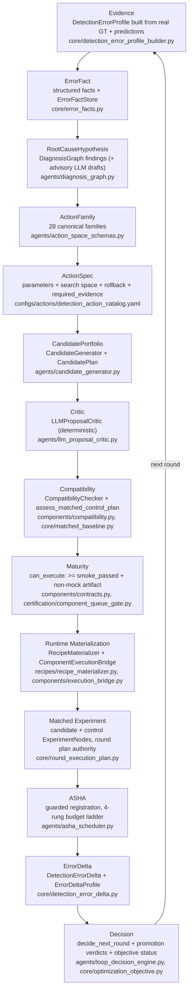

# Automatic Optimization Architecture

> Full system architecture: [architecture.md](architecture.md) — this
> document covers the optimization loop only: how the agent autonomously
> improves detection quality on a dataset, round by round, under measured
> evidence.

## What the loop does

YOLO Agent is a diagnosis-driven experiment manager around the Ultralytics
training runtime. A user states one problem, for example:

```text
Small objects are missed too often; improve AP_small without a large latency or
overall mAP regression.
```

The loop builds a trusted baseline, derives error facts from real ground
truth and real predictions, maps the facts to canonical mechanisms,
materializes compatible recipes, runs matched candidate/control experiments,
and records paired deltas. It never promises that a paper will improve a
dataset. The output of every round is a measured decision, including
rejection, evidence-recovery, and "wait for full approval" outcomes.

## The complete decision loop

Each round walks the same chain. Every arrow is a function in the code; the
module is named so each step can be verified.



Notes on two steps where advisory input exists:

- **RootCauseHypothesis**: an LLM may draft hypotheses and explanations
  (`agents/llm_decision_advisor.py`), but the hypothesis set entering
  planning is produced by the rule-based `DiagnosisGraph`; LLM drafts are
  proposal input only.
- **CandidatePortfolio**: LLM-proposed recipes enter the pool only after the
  deterministic `LLMProposalCritic` rejects proposals without target error
  facts, with more than one changed variable, or violating fixed constraints
  (`imgsz=640`); when paper routes are blocked the loop falls back to
  `decision_mode="deterministic_fallback"`
  (`agents/policy_stage_runner.py`).

## Unified optimization space

The loop plans over one action catalog
(`configs/actions/detection_action_catalog.yaml`, 34 actions across all 28
`ActionFamily` values in `agents/action_space_schemas.py`). Every action
declares a `runtime_phase` — `data | train | inference | eval` — and pydantic
validators structurally enforce the phase boundary: an inference-only family
cannot declare a training phase, and a model-graph family cannot declare an
inference phase (`action_space_schemas.py:190-219`).

The single most important rule of this section: **a component existing in the
catalog is not an executable capability.** Execution requires effective
maturity at or above `smoke_passed` with a verifiable, non-mock artifact
(`components/contracts.py`, `can_execute`); the queue gate blocks anything
below it with `effective_maturity_below_smoke_passed`
(`certification/component_queue_gate.py`). Components that are
metadata-only, recipe-idea-only, or legacy cards without adapters are
planning vocabulary — never executable experiments.

### Data-phase actions (`runtime_phase: data`)

These actions produce data-side work items, not training runs (see the next
section for why they never become ASHA trials).

| Dimension | ActionFamily | Catalog actions | Runtime support |
|-----------|--------------|-----------------|-----------------|
| Data selection | `data_selection` | `data.selection.small_object_focus` | sampling adapters (small-object weighted, class-balanced, repeat-factor) |
| Annotation | `annotation` | `data.audit.annotation_repair` | `AnnotationQualityFilterAdapter`; annotation advice artifacts (`advise_labels`) |
| Data cleaning | `data_cleaning` | `data.cleaning.noise_filter` | `AnnotationQualityFilterAdapter` |
| Sampling | `sampling` | `data.sampling.class_aware`, `data.sampling.hard_negative_mining` | sampling adapters; hard-negative replay manifest from the **train** split (`tools/coco_error_mining.py`) |
| Augmentation | `augmentation` | `data.augmentation.small_copy_paste` | copy-paste / crop transform adapters |
| Preprocessing | `preprocessing` | `data.preprocessing.tile_inference_input` | `NormalizationPreprocessingAdapter`, tiling input policy |

### Model-graph actions (`runtime_phase: train`)

| Dimension | ActionFamily | Catalog actions | Runtime support |
|-----------|--------------|-----------------|-----------------|
| Backbone | `backbone` | `model.backbone.pretrained_swap` (pretrained-weight init + freeze schedule) | **No structural backbone adapter exists.** The legacy `backbone.dsconv` card is metadata-only and not executable |
| Neck | `neck` | paper routes (RTMDet large kernel etc.) | 11 neck adapters (weighted FPN, gold-gd, reparameterized conv, deformable aggregation, attention, lightweight neck, …) |
| Feature Fusion | `feature_fusion` | `model.feature_fusion.gather_distribute` | `GoldGatherDistributeAdapter` |
| Head | `head` | `model.head.task_aligned` | `TaskAlignedHeadAdapter`, `P2HeadAdapter` |
| Input policy | `input_resolution` | `model.resolution.train_imgsz`, `model.resolution.inference_sweep` | **Train-time imgsz is pinned to 640 by policy** (`recipes/paper_priors.py`, `core/matched_baseline.py`); only inference-side resolution sweeps are free |

### Training-objective actions (`runtime_phase: train`)

| Dimension | ActionFamily | Catalog actions | Runtime support |
|-----------|--------------|-----------------|-----------------|
| Assignment | `assignment` | `train.assigner.optimal_transport`, `train.assigner.dynamic_smooth_label` | `YOLO26AssignmentAdapter` |
| BBox loss | `bbox_loss` | `train.bbox_loss.quality.correlation`, `train.bbox_loss.calibration.bpc` | quality-alignment aux-loss adapter; legacy bbox-loss cards (CIoU/WIoU/MPDIoU/NWD) are metadata-only |
| Classification loss | `classification_loss` | `train.cls_loss.positive_reweight` (local) | shared training-control primitives |
| Auxiliary loss | `auxiliary_loss` | `train.aux.mutual_supervision`, `train.aux.pseudo_iou` | `MutualSupervisionAdapter`, `QualityAlignmentAuxiliaryLossAdapter` |
| Distillation | `distillation` | `train.distill.decoupled_features` + 35 paper routes | 36 distillation adapters (`components/adapters/distillation/`) |
| Domain adaptation | `domain_adaptation` | `train.domain.2503_23220` + paper routes | 34 domain-adaptation adapters |
| Semi-supervised | `semi_supervised` | `train.semi.pseudo_label_filter` (local only) | shared primitives (`components/pseudo_label_filter.py`, `components/teacher_ema.py`) via domain-adaptation modes; **no dedicated paper adapter — the frozen-83 set contains no semi-supervised paper** |

### Training-control actions (`runtime_phase: train`, config-level)

| Dimension | ActionFamily | Catalog actions | Runtime support |
|-----------|--------------|-----------------|-----------------|
| Training strategy | `training_strategy` | `train.strategy.ema_schedule`, `train.strategy.freeze_schedule` | `components/training_control.py` primitives; config-level, no dedicated epoch-running adapter |
| Optimizer | `optimizer` | `train.optimizer.lr_schedule_shift` | LR/warmup schedule shift only; **no optimizer-swap adapter exists** |
| Regularization | `regularization` | `train.regularization.aug_schedule` | mosaic close-epochs + weight decay, config-level with rollback |

### Inference-phase actions (`runtime_phase: inference | eval`)

| Dimension | ActionFamily | Catalog actions | Runtime support |
|-----------|--------------|-----------------|-----------------|
| Postprocess | `postprocess` | `inference.nms.soft`, `inference.nms.diou` | inference adapters (merge policy, class-aware threshold, tiled, SAHI slicing) — **executable** |
| Inference | `inference` | `inference.tta.multi_scale` | `TestTimeAugmentationAdapter`, `TiledMultiScaleInferenceAdapter` |
| Calibration | `calibration` | `inference.calibration.temperature` (`fit_split: val`) | `ConfidenceCalibrationInferenceAdapter` — score transform only, ranking unchanged; inference-side only |

Inference-only candidates are structurally excluded from training ASHA:
`register_trial` raises `inference-only candidate cannot enter training ASHA`
(`agents/asha_scheduler.py`), and the eval-route HPO path (below) never
authorizes training-graph changes.

## Data actions are not training runs

A round can legitimately conclude that the best next step is not a model
run. The loop has first-class, budget-free mechanisms for this:

- **Decision vocabulary**: `RoundDecisionAction` includes `collect_data` and
  `request_annotation` (`core/error_round_decision.py`). The only actions
  that consume training budget are `BUDGET_ACTIONS = {"promote", "refine"}`;
  every other decision books or defers instead of training. When the
  objective regresses and the dataset is imbalanced, the decision engine
  emits `collect_data`; otherwise `request_annotation`, which adds a
  `missing_labels` problem tag to the next round's diagnosis.
- **Artifact chain, not executors**: the data stages produce work-list
  artifacts and stop there —
  - `advise_labels` → `annotation_advice.json`/`.md` (classes to collect,
    scenes to annotate, boxes to redraw, labeling-tool targets;
    `agents/data_stage_runner.py`),
  - `mine_samples` → `active_learning_plan.json` (low-confidence /
    high-entropy / model-disagreement acquisition; `tools/active_learning.py`),
  - `label_handoff` → `labeling_manifest.json` + `label_handoff.json`
    (`status: ready_for_labeling`, targeting CVAT/Label Studio),
  - `dataset_promote` → `dataset_promotion.json` with a
    `pending_label_review` gate — the stage **never mutates data**; promotion
    happens only after human label review (`agents/active_learning_stage_runner.py`).
- **ASHA isolation**: a data-side action has no `candidate_config.components`
  plus adapter runtime entrypoint, which is exactly what
  `_is_paper_trial` requires (`agents/asha_scheduler.py`). Annotation
  recommendation, hard-negative collection, and data repair therefore can
  never become a `TrainingNode` or consume ASHA budget — they are work items
  for the next diagnosis round, backed by lineage records
  (`evidence.record_lineage`).

## Six coverage numbers

The loop separates these quantities, and each automatic round prints the
funnel and writes it to `artifacts/executable_portfolio.yaml`:

1. Catalog papers: papers known to the offline catalog.
2. Method profiles: papers with local evidence describing their method.
3. Recipe definitions: reusable mechanism recipes, including paper priors.
4. Runtime-ready recipes: recipes whose components have frozen implementation
   identity and valid non-mock maturity artifacts.
5. Diagnosis-matched recipes: recipes bound to the current run's error facts.
6. Executable trials: candidate/control experiments actually registered with
   ASHA.

The first three are knowledge assets. Only the last three describe what can
participate in the current training run.

## Runtime authority

Paper names and titles are priors. Training authorization comes from the
frozen research snapshot and its effective maturity manifest:

```text
PaperMethodProfile -> canonical mechanism -> recipe -> adapter contract
  -> adapter hash + Ultralytics version + protocol hash
  -> non-mock runtime/unit/smoke evidence -> matched pilot/control
```

At train startup, the CLI discovers all reusable training adapters rather
than only a fixed shortlist. It refreshes missing or stale CPU evidence
automatically. A failed adapter is isolated and reported; it cannot silently
become ordinary Ultralytics training. Snapshot identity is checked again
before materialization.

Reviewed local recipe families are merged by the research production
pipeline before the snapshot is hashed. Training reads only the frozen
recipe registry; it never fills gaps from a live paper or recipe registry
during a run. Source paths and parse errors are recorded in the executable
portfolio artifact.

## Why low-fidelity pilots can regress

Three-epoch, ten-percent pilots are screening measurements, not final
claims. The default ASHA policy treats small pilot deltas inside a
`-0.0015` noise band as rankable cohort evidence. Severe regressions,
invalid paired evidence, diagnosis failures, and resource-guard failures are
still eliminated early.

`pilot_10` still requires a verified positive paired delta and target
error-fact improvement. Full training and confirmation seeds remain explicit
`--confirm-full-run` operations. A pilot signal is never reported as exact
paper reproduction.
